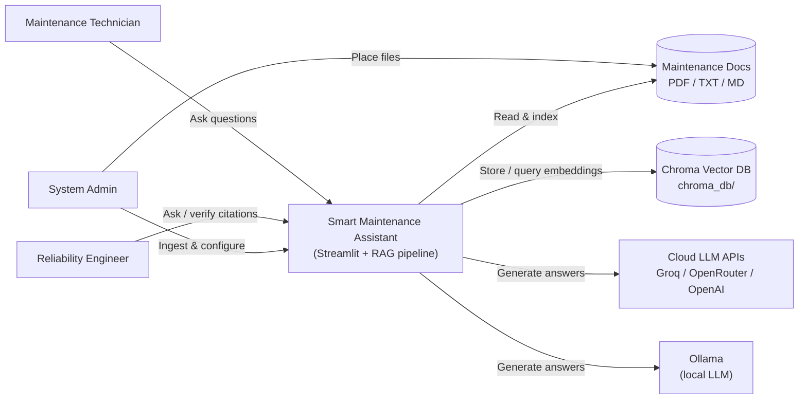
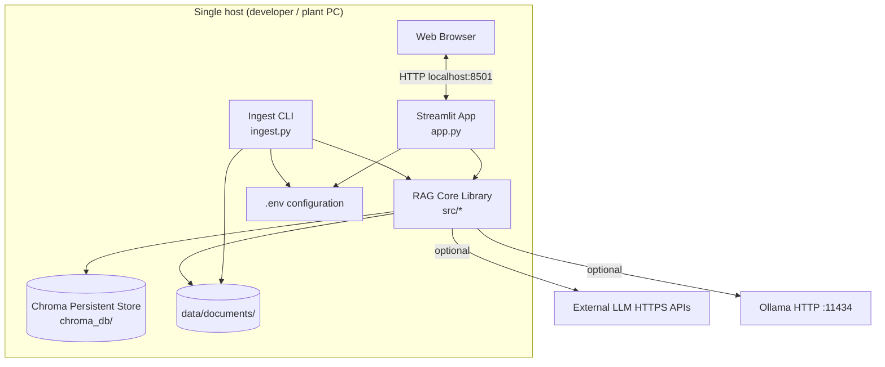
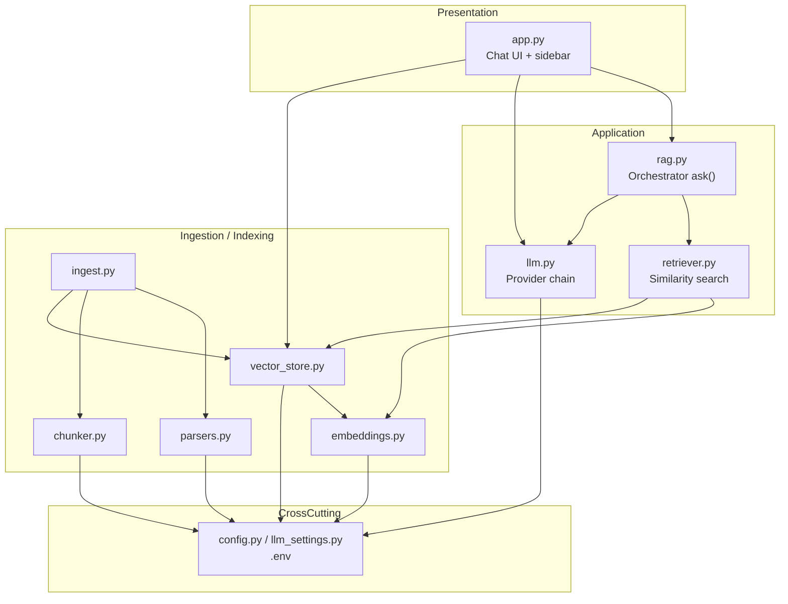
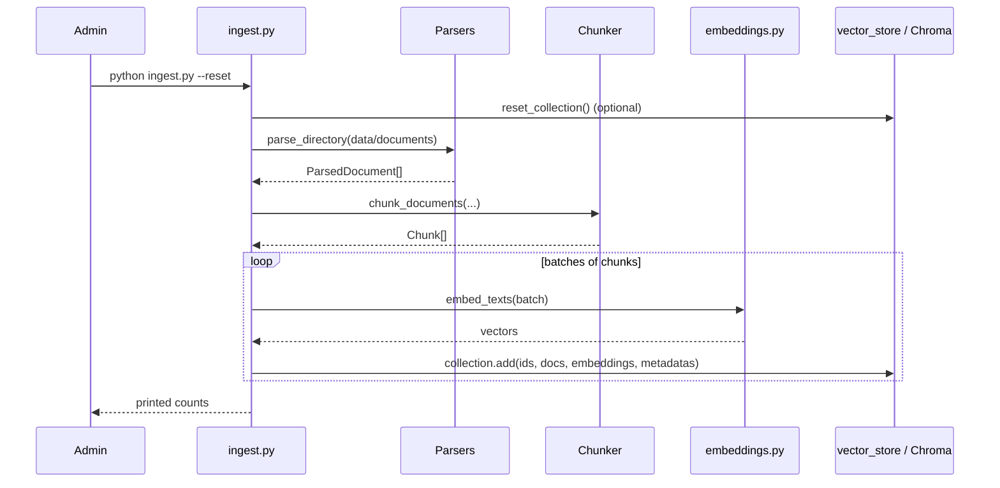
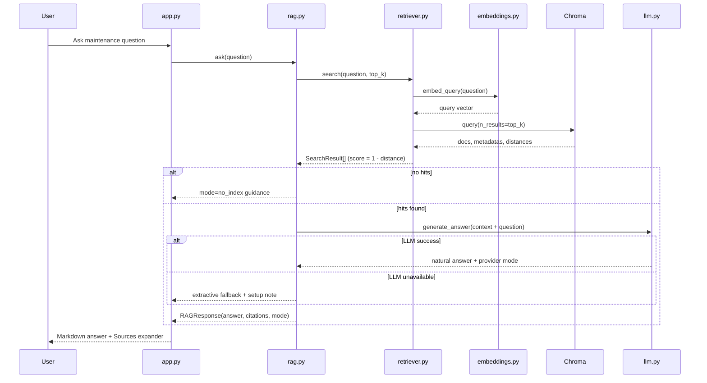
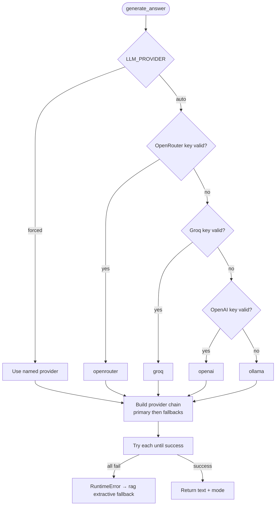
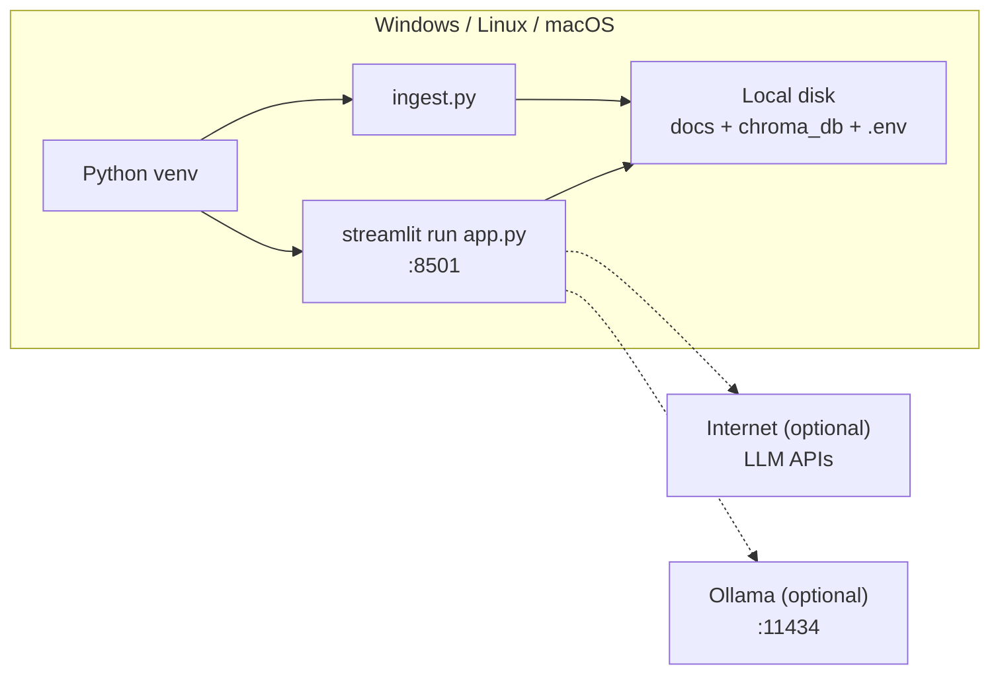

# System Architecture

## Smart Maintenance Assistant

| Field | Value |
|-------|--------|
| **Document title** | System Architecture Document |
| **Product** | Smart Maintenance Assistant |
| **Version** | 1.0 |
| **Status** | Baseline |
| **Date** | July 2026 |
| **Related docs** | [SRS.md](./SRS.md), [README.md](../README.md) |

---

## 1. Purpose

This document describes the **logical and physical architecture** of the Smart Maintenance Assistant: a Retrieval-Augmented Generation (RAG) system that answers predictive-maintenance questions from plant documentation with cited, grounded responses.

It is intended for developers, reviewers, and portfolio evaluation.

---

## 2. Architectural goals and principles

| Goal | How the architecture supports it |
|------|----------------------------------|
| **Grounded answers** | Retrieve-then-generate; LLM sees only retrieved excerpts; citations required |
| **Local-first indexing** | Embeddings via `sentence-transformers` on-device; no API key for ingest |
| **Provider flexibility** | Pluggable LLM backends (Groq, OpenRouter, OpenAI, Ollama) + extractive fallback |
| **Modularity** | Clear pipeline stages in separate `src/` modules |
| **Demo readiness** | Single-machine deploy: CLI ingest + Streamlit UI |
| **Testability** | Pure logic separable from UI; heavy deps mockable in `tests/` |

**Design principles**

1. **Separation of concerns** — parsing, chunking, embedding, storage, retrieval, generation, and UI are distinct layers  
2. **Fail soft** — missing LLM → extractive mode; empty index → clear guidance  
3. **Configuration over code** — providers and tuning via `.env`  
4. **Traceability** — every answer can point back to source chunks  

---

## 3. System context (C4 Level 1)



**External actors**

| Actor | Interaction |
|-------|-------------|
| Technician / Engineer | Chat Q&A via browser |
| Admin | Document drop, `ingest.py`, `.env` keys |
| Cloud LLM | Optional chat-completion API |
| Ollama | Optional local chat API |
| Document corpus | Source of truth for procedures |

---

## 4. Container view (C4 Level 2)



| Container | Technology | Responsibility |
|-----------|------------|----------------|
| **Streamlit App** | Python, Streamlit | Chat UI, sidebar status, session message history |
| **Ingest CLI** | Python argparse | Batch parse → chunk → embed → upsert/reset Chroma |
| **RAG Core** | Python packages under `src/` | All pipeline logic |
| **Chroma DB** | chromadb PersistentClient | Vector + document + metadata persistence |
| **Documents** | Filesystem | Authoritative SOP/manual corpus |
| **Config** | python-dotenv | Secrets and tuning parameters |

---

## 5. Component view (C4 Level 3)



### 5.1 Component catalog

| Module | Role | Key outputs |
|--------|------|-------------|
| `parsers.py` | Load PDF/TXT/MD into `ParsedDocument` | Text + source + page |
| `chunker.py` | Split text with overlap & sensible separators | `Chunk` list |
| `embeddings.py` | Local MiniLM embeddings (LRU-cached model) | `list[float]` vectors |
| `vector_store.py` | Chroma get/create/add/reset/count | Persistent collection |
| `retriever.py` | Query embed + top-k cosine search | `SearchResult` + scores + citation ids |
| `llm.py` | Resolve provider; call OpenRouter/Groq/OpenAI/Ollama | Answer text + mode name |
| `rag.py` | Compose context; call LLM; extractive fallback | `RAGResponse` |
| `config.py` | Paths, chunk/top-k, provider env defaults | Runtime constants |
| `app.py` | Presentation & status | User-visible chat |
| `ingest.py` | Offline indexing entrypoint | Updated Chroma collection |

---

## 6. End-to-end data flows

### 6.1 Ingestion pipeline (write path)



**Transformations**

| Stage | Input | Output |
|-------|-------|--------|
| Parse | Files | Plain text sections |
| Chunk | Long text | ~`CHUNK_SIZE` overlapping pieces |
| Embed | Chunk text | Dense vectors (`all-MiniLM-L6-v2`) |
| Store | Text + vector + metadata | Durable Chroma records |

### 6.2 Query pipeline (read path)



### 6.3 LLM provider resolution



Placeholder keys such as `your_groq_key_here` are treated as **unset**.

---

## 7. Logical layered architecture

```text
┌─────────────────────────────────────────────────────────┐
│  Presentation Layer                                      │
│  app.py (Streamlit) — chat, sidebar, sources UI          │
├─────────────────────────────────────────────────────────┤
│  Application / Orchestration Layer                       │
│  rag.py — ask(), context formatting, fallbacks           │
│  ingest.py — batch indexing workflow                     │
├─────────────────────────────────────────────────────────┤
│  Domain Services                                         │
│  retriever.py · llm.py · parsers · chunker · embeddings  │
├─────────────────────────────────────────────────────────┤
│  Infrastructure                                          │
│  vector_store.py (Chroma) · httpx/OpenAI SDK · dotenv    │
│  filesystem (data/documents, chroma_db)                  │
└─────────────────────────────────────────────────────────┘
```

---

## 8. Data architecture

### 8.1 Data stores

| Store | Type | Contents | Lifetime |
|-------|------|----------|----------|
| `data/documents/` | Files | Source SOPs/manuals | Durable, human-edited |
| `chroma_db/` | Embedded DB | Chunk text, embeddings, metadata | Durable until `--reset` |
| `.env` | Config file | API keys, models, chunk/top-k | Durable secrets (local) |
| Streamlit `session_state` | In-memory | Chat transcript for browser session | Ephemeral |

### 8.2 Chunk metadata schema

| Field | Type | Description |
|-------|------|-------------|
| `source` | string | Original filename |
| `page` | int | PDF page, or `-1` if N/A |
| `chunk_id` | int | Index within parent document section |
| Document id | string | `{source}::p{page}::c{chunk_id}::{index}` |

### 8.3 Runtime response model

```text
RAGResponse
├── answer: str          # Markdown shown to user
├── citations: SearchResult[]
│   ├── text, source, page, chunk_id
│   ├── score            # cosine similarity ≈ 1 - distance
│   └── citation_id      # 1-based [n] marker
└── mode: str            # e.g. groq | extractive | no_index
```

---

## 9. Deployment architecture

### 9.1 Local single-node (current)



**Typical startup**

1. `python -m venv venv` → `pip install -r requirements.txt`  
2. Configure `.env`  
3. `python ingest.py --reset`  
4. `streamlit run app.py`  

### 9.2 Process view

| Process | When it runs | Notes |
|---------|--------------|-------|
| Ingest | On-demand CLI | Can run while UI is stopped; restart UI not required for Chroma reads after ingest completes |
| Streamlit | Long-running | Loads `.env` via modules; hot-reload may need restart after `.env` changes |
| Ollama | Optional daemon | Must be up if selected/fallback local provider |

### 9.3 Future deployment options (not implemented)

| Option | Use case |
|--------|----------|
| Docker Compose (app + Ollama + volume for chroma) | Reproducible plant PC install |
| Internal reverse proxy + auth | Multi-user trusted network |
| Separated ingest worker | Large corpus / scheduled re-index |

---

## 10. Cross-cutting concerns

### 10.1 Configuration

Centralized in `src/config.py` (and LLM helpers in `llm.py` / `llm_settings.py`):

| Variable | Affects |
|----------|---------|
| `EMBEDDING_MODEL` | Vector space (re-ingest required if changed) |
| `CHUNK_SIZE` / `CHUNK_OVERLAP` | Index granularity |
| `TOP_K` | Retrieval breadth |
| `LLM_PROVIDER` + `*_API_KEY` / `*_MODEL` | Generation backend |

### 10.2 Security

| Concern | Approach |
|---------|----------|
| API secrets | `.env` only; not hardcoded |
| Network exposure | Local Streamlit by default |
| Prompt safety | System prompt restricts answers to excerpts |
| Operational safety | Citations for human verification; NFR decision-support disclaimer |

### 10.3 Observability

| Signal | Where |
|--------|-------|
| Indexed chunk count | Sidebar metric |
| Active provider / model | Sidebar caption |
| Response mode | Caption under assistant message |
| Ingest logs | CLI stdout |
| OpenRouter limits | Optional sidebar expander |

### 10.4 Error handling strategy

| Condition | Behavior |
|-----------|----------|
| Empty Chroma | `mode=no_index` message |
| Invalid/missing LLM keys | Skip provider; try next; then extractive |
| LLM HTTP/runtime failure | Next provider in chain → extractive |
| Unsupported file type | Skip (directory) or raise (single file) |

---

## 11. Technology stack

| Layer | Choice | Rationale |
|-------|--------|-----------|
| UI | Streamlit | Fast chat prototype, low boilerplate |
| Language | Python 3.10+ | ML/RAG ecosystem |
| Embeddings | sentence-transformers MiniLM | Local, free, sufficient for SOP retrieval |
| Vector DB | Chroma | Persistent, simple Python API, cosine space |
| PDF | pypdf | Lightweight text extraction |
| LLM clients | OpenAI SDK (compatible) + httpx (Ollama) | One pattern for multiple hosts |
| Config | python-dotenv | Portable local secrets |
| Tests | pytest | Module isolation with mocks |

---

## 12. Quality attributes mapping

| Quality attribute | Architectural mechanism |
|-------------------|-------------------------|
| **Accuracy / trust** | RAG + citations + anti-hallucination system prompt |
| **Availability** | Extractive fallback when LLMs fail |
| **Maintainability** | Thin UI over modular `src/` pipeline |
| **Portability** | Pure Python + local Chroma files |
| **Performance** | Cached embedding model; batched ingest; small top-k |
| **Privacy** | Local embeddings; optional fully local Ollama path |
| **Testability** | `tests/` per module; mocks for Chroma/LLM/embeddings |

---

## 13. Repository structure (architecture map)

```text
smart-maintenance-assistant/
├── app.py                 # Presentation
├── ingest.py              # Write-path entrypoint
├── src/
│   ├── parsers.py         # Document I/O
│   ├── chunker.py         # Text segmentation
│   ├── embeddings.py      # Vectorization
│   ├── vector_store.py    # Persistence adapter
│   ├── retriever.py       # Read-path search
│   ├── llm.py             # Generation adapters
│   ├── rag.py             # Use-case orchestration
│   └── config.py          # Settings
├── data/documents/        # Knowledge corpus
├── chroma_db/             # Vector index (generated)
├── tests/                 # Architecture verification
├── docs/
│   ├── SRS.md
│   └── SYSTEM_ARCHITECTURE.md
└── requirements.txt
```

---

## 14. Architectural risks and mitigations

| Risk | Impact | Mitigation |
|------|--------|------------|
| Poor PDF text extraction | Empty/noisy chunks | Prefer MD/TXT; future OCR |
| Embedding model change without re-ingest | Bad retrieval | Document re-ingest requirement |
| Cloud LLM outage / rate limits | No generative answer | Provider chain + extractive mode |
| Stale index after SOP edit | Wrong thresholds | Admin journey: `--reset` re-ingest |
| Over-trust in AI answers | Safety incidents | Citations + decision-support disclaimer |

---

## 15. Summary

The Smart Maintenance Assistant follows a classic **RAG architecture** on a **single-node deployment**:

1. **Index** documents locally into Chroma with MiniLM embeddings  
2. **Retrieve** top-k similar chunks for each question  
3. **Generate** a cited answer via a configurable LLM, or show excerpts if none is available  
4. **Present** results in Streamlit with transparent sources  

This keeps the design simple enough for a portfolio demo while remaining extensible toward CMMS, sensors, and multi-user plant deployments described in the SRS roadmap.

---

*End of System Architecture Document — Smart Maintenance Assistant v1.0*
